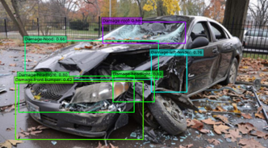

# CrashCal 🚗🔧  
AI-powered car crash image analyzer for damage detection, location classification, severity prediction and repair cost estimation.

## Highlights
- Multi-stage deep learning pipeline to automate car damage claim triage  
- Uses **5 pre-trained EfficientNet models** for verification, classification, and regression  
- Trained on **20,000+ annotated images** scraped from Google & Kaggle  
- Real-time deployment using **Flask** with Bootstrap-based UI  
- Predicts crash location, severity level, and repair cost estimate

## Table of Contents
1. [Objective](#objective)  
2. [Dataset](#dataset)  
3. [Model Architecture & Pipeline](#model-architecture--pipeline)  
4. [Training & Evaluation](#training--evaluation)  
5. [Tech Stack](#tech-stack)  
6. [Usage](#usage)  
7. [Demo](#demo)  
8. [Challenges](#challenges)  
9. [Future Work](#future-work)

## Objective

To automate vehicle crash damage assessment using image-based deep learning models, providing fast and accurate predictions for insurance processing and claim estimation.

## Dataset
| Source            | Images  | Labels                          |
|-------------------|---------|----------------------------------|
| Google & Kaggle   | ~20,000 | Car vs Non-Car, Damage Yes/No, Location (Front/Rear/Side), Severity (Minor/Moderate/Severe) |
| car_price_data.csv|  Car make/model/year + part prices       |

Images were preprocessed, resized (224×224), and augmented (rotation, brightness, flip) before training.

## Use Case

In the traditional auto insurance industry, damage claims require in-person inspections, making the process slow, manual, and error-prone. CrashCal streamlines this by using computer vision to assess vehicle damage from images — reducing time, cost, and potential fraud. This proof-of-concept demonstrates how deep learning can automate damage detection, enhance customer experience, and accelerate claim processing.

## Solution

CrashCal analyzes a submitted car image through a 5-step pipeline:

1. Validates image contains a car  
2. Detects if the car is damaged  
3. Predicts damage location: Front / Rear / Side  
4. Classifies severity: Minor / Moderate / Severe  
5. Estimates repair cost based on training data

Future versions could automate documentation and integrate with insurance systems for end-to-end claim filing.

## Challenges

- Varying image quality (angle, light, resolution) affects accuracy  
- Limited availability of large, annotated crash datasets  
- High compute cost for training/deploying deep models  
- Needs fraud detection safeguards and human override options  
- Secure architecture is essential for handling personal/financial data

## Model Architecture and Pipeline

CrashCal processes the input image through a multi-stage deep learning pipeline:

1. **User Input** – User uploads an image of a potentially damaged car  
2. **Gate 1: Car Verification** – Classifies whether the image contains a car  
3. **Gate 2: Damage Detection** – Checks if visible damage is present  
4. **Damage Location Classifier** – Identifies where the damage occurred: Front / Rear / Side  
5. **Severity Classifier** – Predicts the severity of the damage: Minor / Moderate / Severe  
6. **Price Prediction** – Estimates the repair cost using part + brand/model context  
7. **Result Output** – Returns results to the user or an external system (e.g., insurer)

Each stage is powered by a pre-trained EfficientNet model fine-tuned for the respective task.

## Training & Evaluation

| Model                     | Accuracy | F1 Score | ROC-AUC |
|--------------------------|----------|----------|---------|
| Car vs Non-Car           | 95%      | 0.95     | 0.96    |
| Damage Detection         | 92%      | 0.91     | 0.93    |
| Location Classification  | 89%      | 0.87     | 0.90    |
| Severity Classification  | 85%      | 0.82     | 0.86    |
| End-to-End Pipeline      | **87%**  | **0.84** | **0.88**|

Mean Absolute Error for price prediction: **\$356**  
Average prediction time: **< 200 ms per image**

## Tools & Frameworks Used

**Dataset Collection**  
- Google Images, Kaggle, Import.io

**Model Development**  
- TensorFlow, Keras – Deep Learning  
- NumPy, scikit-learn – Data processing & ML utilities  

**Web Development**  
- Flask – Python-based web framework  
- Bootstrap – Responsive frontend styling (HTML/CSS/JS)

**Development Environment**  
- Jupyter Notebooks, Anaconda (virtual env)  
- PyCharm IDE

**Libraries**  
- numpy, pandas, matplotlib, seaborn, scikit-learn, pickle

## Future Model Improvements

1. Expand training data to detect specific damaged components (e.g., bumper, headlight, hood)  
2. Integrate car brand/model/year with part pricing for smarter cost estimation  
3. Move to secure cloud infrastructure for mobile-friendly, scalable usage  
4. Add insurance policy suggestions based on predicted damage and user profile

## Sample Output

CrashCal identifies and labels multiple damaged parts from a single image using bounding boxes and confidence scores.

## Demo

https://github.com/user-attachments/assets/3726defc-7f66-4a8c-b305-d80f81805564
